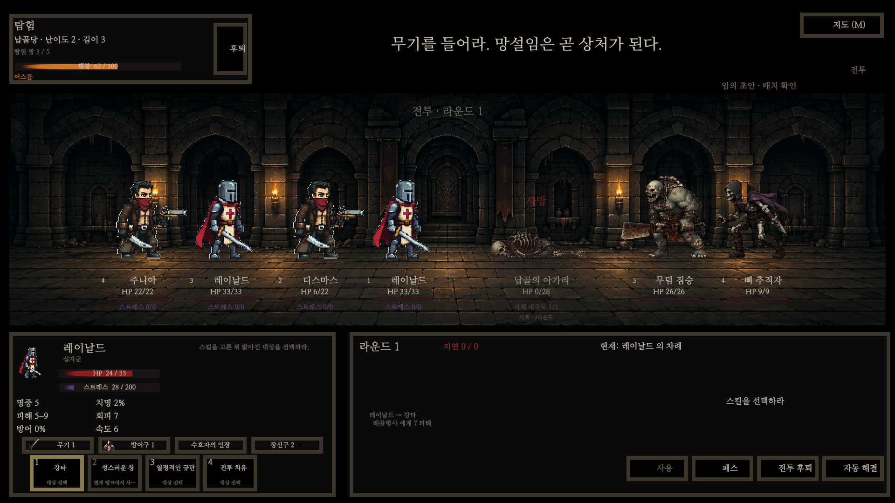
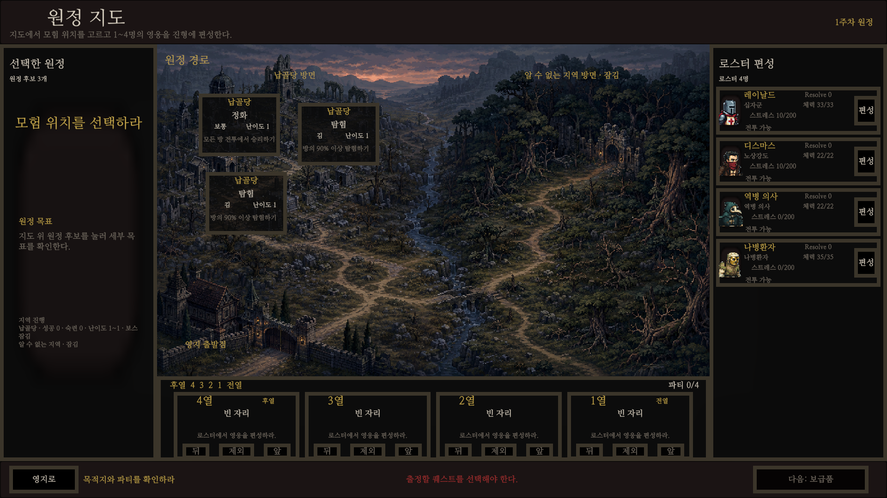
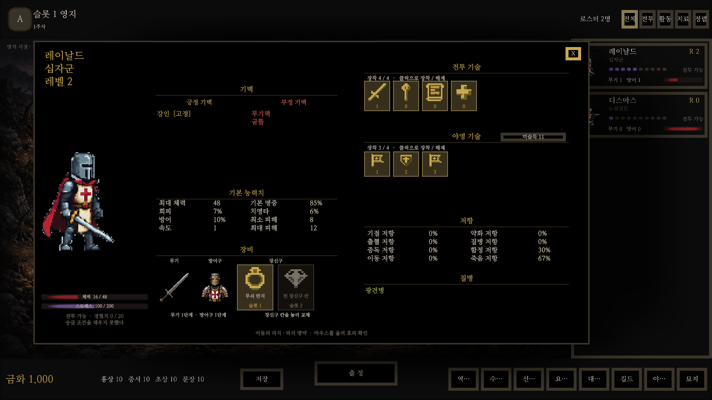

# ABYSS | Game Programming Portfolio

Unity와 C#으로 구현한 2D 턴제 RPG **Abyss**의 게임 프로그래밍 포트폴리오입니다.
전투·탐험·영지·저장 시스템의 설계와 문제 해결 과정을 소개하고,
선별한 코드와 독립 실행 테스트를 제공합니다.

**[포트폴리오 PDF 보기](portfolio/Abyss_Game_Programmer_Portfolio.pdf)**



## 빠르게 살펴보기

| 확인할 역량 | 코드·자료 | 핵심 내용 |
|---|---|---|
| 시스템 설계 | [아키텍처](docs/architecture.md) | 순수 C# 규칙과 Unity 화면의 책임 분리 |
| 전투 콘텐츠 구현 | [효과 실행기](docs/combat-effects.md) | typed 효과와 4단계 실행 순서 |
| 자료구조·알고리즘 | [그래프 탐색 샘플](src/GraphSearch.cs) | BFS 최단 거리와 안정적인 동률 처리 |
| 결정론·재현성 | [난수 스트림](src/RandomStreams.cs) | 7개 시스템의 난수 소비 격리와 상태 복원 |
| 저장 안정성 | [저장·복원 사례](docs/save-atomicity.md) | 사전 검증과 원자적 파일 교체 |
| Unity·개발 도구 | [UI·자동화 사례](docs/unity-tooling.md) | 씬 생성기, JSON 검증, 사망 HP 표시 수정 |
| 테스트 | [테스트 코드](tests/) | 비간섭·저장 재개·그래프 경계 조건 검증 |

## 기술과 구현 범위

- **게임:** C#, Unity 6, URP, uGUI, Input System
- **설계:** 계층 분리, 불변 조회 모델, 명령 서비스, 타입 기반 스킬 효과
- **알고리즘:** BFS, Queue·Dictionary 기반 탐색, PCG32 기반 난수 스트림
- **도구:** Git, JSON, PowerShell, .NET, NUnit 및 자체 테스트 하네스
- **AI 활용:** Codex를 코드 작성·리팩터링·테스트 작성에 활용하고 규칙 명세와 실행 결과로 검증

원본 게임은 영웅 편성·보급, 던전 탐험과 전투, 귀환·성장·영지 운영을 연결합니다.
이 저장소는 채용 검토에 필요한 **코드 샘플과 설명 자료**를 공개한 별도 저장소입니다.

## 실행

필요 환경: **.NET SDK 10.0**. Unity나 외부 NuGet 패키지는 필요하지 않습니다.

```bash
dotnet run --project Abyss.Portfolio.csproj -c Release
```

성공하면 테스트별 결과와 전체 통과 수가 출력됩니다. 실패한 검사는 0이 아닌 종료 코드를 반환합니다.

## 공개 코드의 구성

- 난수 관련 세 파일은 Abyss의 구현을 발췌하고 제출용으로 주석을 정리했습니다.
- `GraphSearch`는 원본 던전 생성기의 BFS·보스방 동률 선택 로직을 독립 인접 목록 API로 추출한 샘플입니다.
- 효과 실행기와 저장 시스템은 설계 설명 및 짧은 발췌를 제공합니다.
- 독립 테스트는 이 공개 샘플에 맞게 구성했습니다. 전체 게임의 테스트 개수와 구분됩니다.
- 게임 전체 Core, 캠페인·콘텐츠 데이터, Unity 실행 프로젝트와 원본 개발 이력은 포함하지 않습니다.

## 프로젝트 화면

### 원정 지도



### 영웅 상태창



화면은 Unity UI 렌더 캡처입니다. 시각 자산에는 생성형 이미지 도구로 제작·후처리한 자산이 포함됩니다.

## 이용 범위

채용 평가와 코드 검토를 위한 자료입니다. 열람·로컬 실행 범위 및 제품 이용 제한은
[LICENSE.md](LICENSE.md)를 참고해 주세요. PCG 알고리즘 출처는
[THIRD_PARTY_NOTICES.md](THIRD_PARTY_NOTICES.md)에 기재했습니다.
