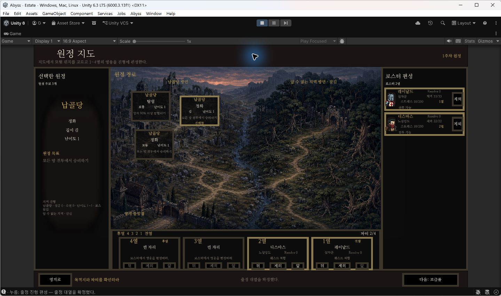
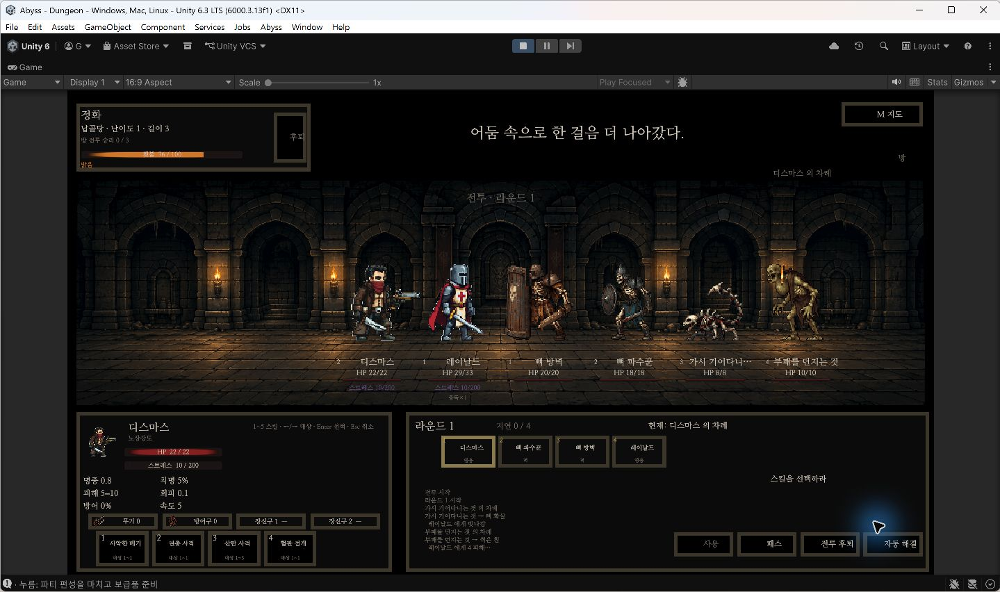
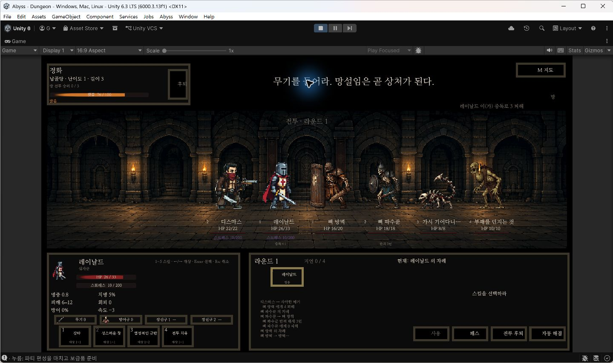
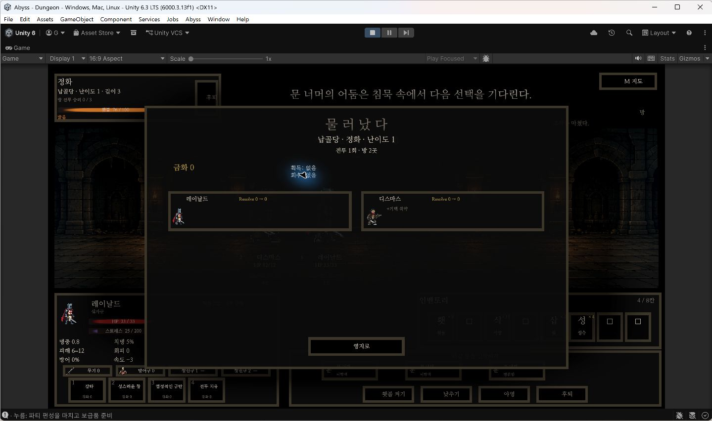
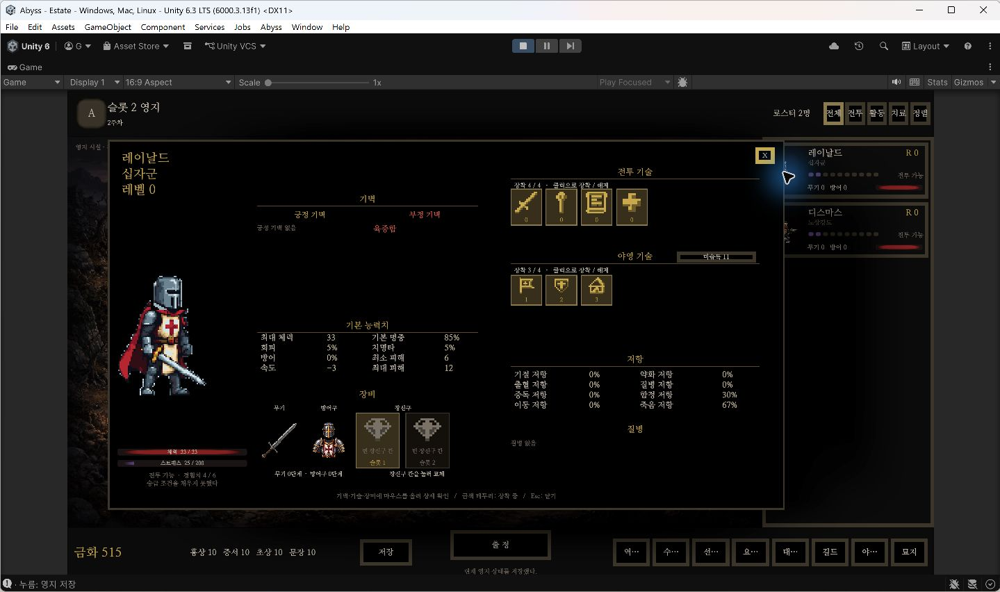
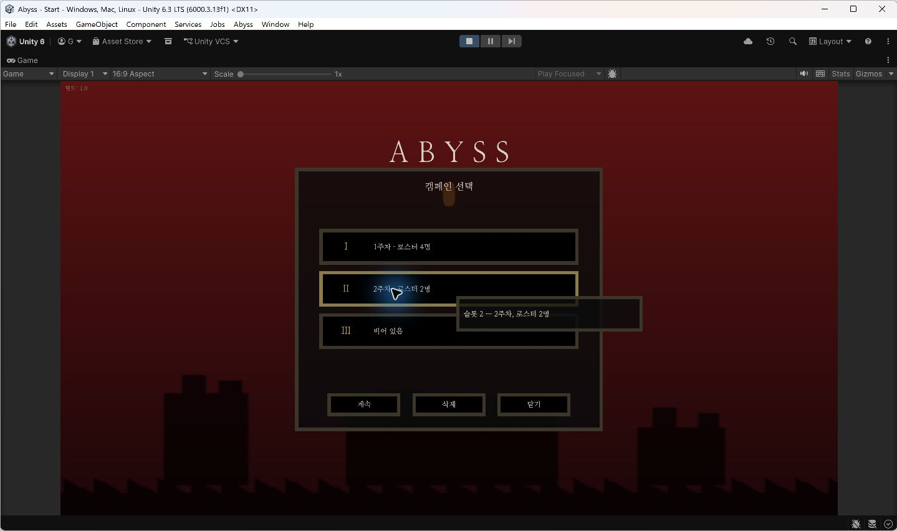

# 플레이 흐름과 완료 범위

같은 캠페인에서 **파티 편성 → 전투 입력 → 후퇴 귀환·결산 → 저장·재개**를 연속으로 확인했습니다. 아래 화면은 슬롯 2에서 실제 UI 입력으로 진행한 기록입니다.

## 행동과 결과

| 단계 | 수행한 행동 → 확인한 결과 |
|---|---|
| 파티 편성·출발 | 레이날드·디스마스 2명을 편성하고 납골당 정화 원정(난이도 1·길이 3)에 출발 → 추천 보급품에 금화 485를 사용해 보유 금화가 1,000에서 515로 변경 |
| 전투 진행 | 디스마스의 **사악한 베기**를 선택하고 뼈 방벽을 클릭 → 전투 로그에 피해 4, 대상 HP가 **20/20 → 16/20**으로 변경 |
| 귀환·결산 | 전투 후퇴 후 원정 후퇴를 선택 → 방 2곳·전투 1회의 **후퇴 귀환**, 금화 보상 0, 디스마스에게 부정 기벽 **허약** 반영. ‘영지로’를 눌러 2주차 진입 |
| 저장·재개 | 영지에서 저장한 뒤 Unity Play Mode를 종료·재실행하고 슬롯 2를 이어하기 → 영웅·HP·스트레스·금화·주차 복원. 다시 저장한 파일과 재개 전 파일의 전체 내용 일치 |

### 1. 파티 편성·출발

### 2. 전투 입력에 따른 상태 변화

**공격 전 — 뼈 방벽 HP 20/20**

**공격 후 — 사악한 베기 피해 4, 뼈 방벽 HP 16/20**

### 3. 후퇴 귀환·결산

### 4. 저장 후 Play Mode 재실행·재개

**저장 전 — 2주차 영지, 레이날드 HP 33/33·스트레스 25, 금화 515**

**재실행 — 시작 화면에서 슬롯 2 이어하기**

**재개 후 — 같은 영지·영웅 상태 복원**

## 저장 전후 비교

| 비교 항목 | 저장 전 | 재개 후 |
|---|---|---|
| 주차 | 2주차 | 2주차 |
| 보유 금화 | 515 | 515 |
| 보유 영웅 | 레이날드·디스마스 | 레이날드·디스마스 |
| 레이날드 HP / 스트레스 | 33/33 / 25 | 33/33 / 25 |
| 디스마스 HP / 스트레스 | 22/22 / 25 | 22/22 / 25 |
| 디스마스의 귀환 후 기벽 | 허약 | 허약 |
| 진행 원정 | 없음·영지 복귀 완료 | 없음·영지 복귀 완료 |

화면에 보이는 상태를 대조하고, 저장 전과 재개 후 다시 저장한 파일을 바이트 단위로 비교했습니다. **두 파일은 5,105바이트로 전체 내용이 일치했습니다.**

화면 입력에 따른 상태 변화와 저장 복원은 위 플레이로 확인했습니다. 난수 상태 복원 후 다음 결과가 이어지는지는 별도의 [난수 회귀 테스트](../tests/RandomnessTests.cs)에서 7개 스트림을 서로 다른 소비 지점에 저장한 뒤, 복원 전후의 정수·실수 수열을 비교합니다.

**검증 환경:** Windows · Unity 6000.3.13f1 Editor Play Mode · 2026.09.07 · 게임 코드 `ca3674f`

**확인 범위:** 2인 편성·보급·출정, 방 2곳 탐험, 전투 스킬 입력, 후퇴 귀환·결산, 다음 주차, 영지 저장·재개

**확인 방법:** 수동 입력·연속 화면 캡처·Play Mode 종료와 재실행·저장 전후 상태 및 파일 비교
